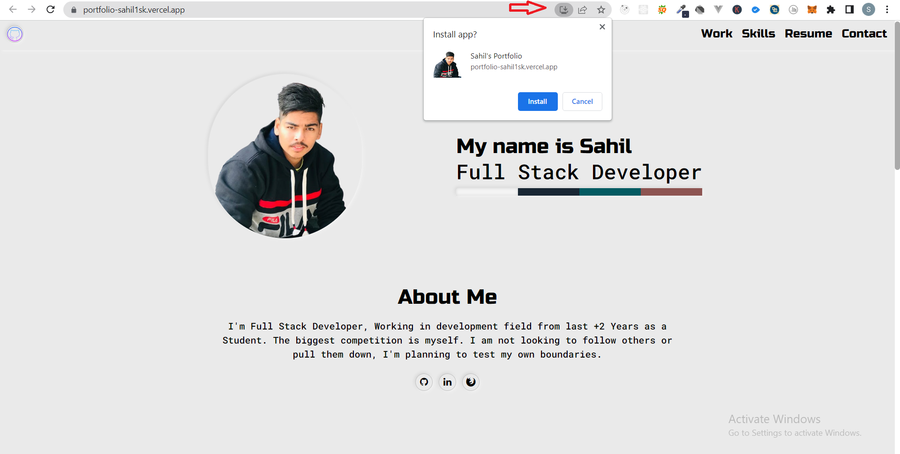
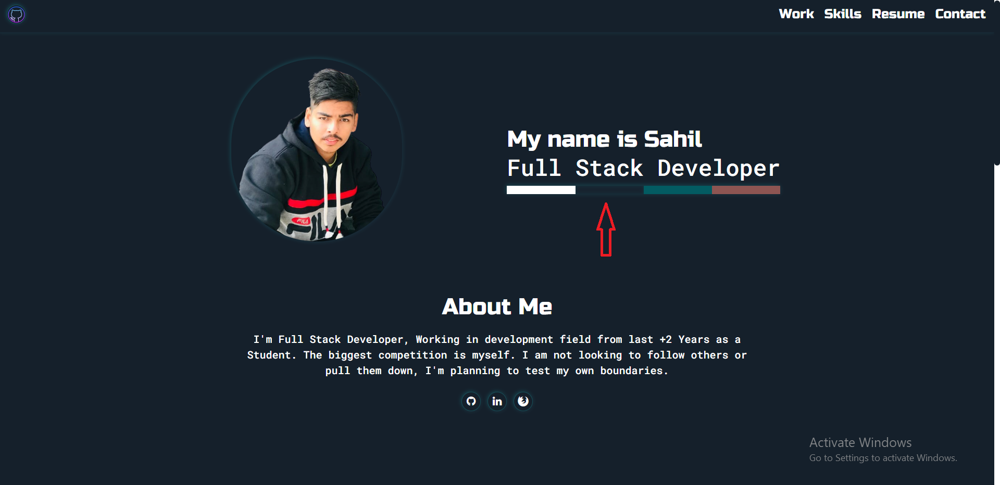

(Astro Portfolio) 
Simple and Fast to access Portfolio Site, What is different 🤔 from others ? It will work offline once you got there next time no internet needed, it will work offline and also just by one click convert whole website into Desktop or Mobile App, Fully Responsive Portfolio. 

## Features:
1. PWA (Progressive Web Application)
2. Works Offline as well.
3. Fast & Simple Interface
4. Web Convertible to Desktop Mobile Apps as well.
5. Different Color Themes available

## LIVE URL'S 
> Frontend WEBSITE LIVE => 'https://portfolio-sahil1sk.vercel.app'

 

## Tech Used
> 1 Astro  
> 2 HTML, CSS, BootStrap and Javascript  
> 3 Added Service Workers to make it work offline

 

## Demo Images 

* Home Page  

* Different Themes

* Desktop Version  

* Mobile Version

* My Work

* Skills

* Contact Images

